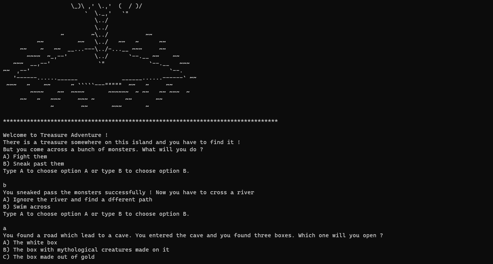

# Treasure-Adventure
A very simple choose your own adventure type game made for #Day3 of #100DaysOfCode challenge in python. I learnt a lot about if-else statements by making this project. 

  

## Try Out This Project
You can play this game on my replit https://replit.com/@DracoPythondev/Treasure-Adventure?v=1
